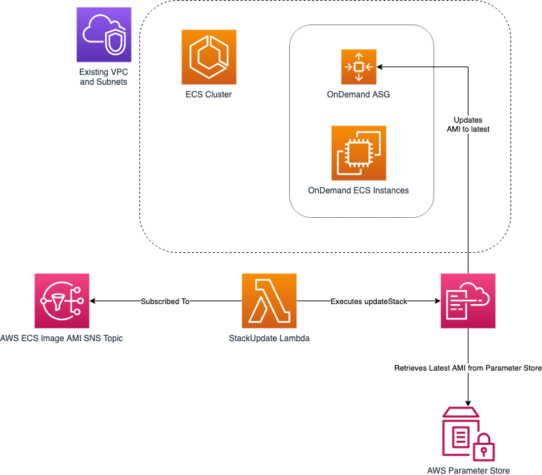

# aws-cfn-ecs-ami-updates

This [AWS CloudFormation template](./ecs_cluster_auto_update_ami.cfn.yml) helps you deploy an inline Lambda function can be used to automatically update ECS Cluster EC2 Instances to the latest AMI as soon as they become available.

## High level Solution

This template assumes you already have a VPC with suitable subnets to deploy your ECS Cluster EC2 instances into.

At a high level, this template will deploy:
* ECS Cluster
* OnDemand Launch Configuration using ECS-optimized AMI
* AutoScalingGroup to launch 1 or more Instances
* Lambda function subscribed to AWS SNS Topic for ECS-optimized AMI updates

When a new ECS-optimized AMI is available, the Lambda function will be invoked and will execute an updateStack with the previous parameters.  As we're using an Systems Manager Parameter for the AMI, if the value differs from the last time the stack was updated then the LaunchConfiguration will be replaced, which will trigger the AutoScalingGroup to replace the existing instances with new ones.



## Considerations

You will need to evaluate your environment and applications to determine if you should you use this in a Production environment.

Ideally you would have already incorporated the mechanisms detailed in the [ECS Cluster Manager](https://github.com/awslabs/ecs-cluster-manager) to ensure Instance replacement runs as expected. Updating the AMI should have no impact with rolling updates.

Please validate the IAM Policies and SecurityGroups included in this template before launching it.

## ECS EC2 Instances

If you're using EC2 instances for your ECS cluster, then keeping these instances updated and secure must be a high priority.
Other services such as AWS ElasticBeanstalk provide Managed Updates that perform this function for you.  However at this time this isn't available for ECS EC2.  

#### ECS Fargate

ECS Fargate negates the need for this solution and is a great option for deploying containers without having to manage EC2 instances.

## EC2 AutoScaling group

This template launches an AutoScaling group of OnDemand instances, using the ECS-optimized AMI as detailed below.  These instances are automatically registered with the ECS Cluster.

## ECS-optimized AMIs

If you are running an ECS Cluster, then AWS recommend you use their ECS-optimized AMIs.
https://docs.aws.amazon.com/AmazonECS/latest/developerguide/ecs-optimized_AMI.html

While these AMIs are detailed on the page above, the best place to get the latest will be from AWS Systems Manager - Parameter Store:
https://docs.aws.amazon.com/AmazonECS/latest/developerguide/ecs-ami-versions.html

The latest amazon-linux-2 AMI metadata can be retrieved as such:

```

$ aws ssm get-parameters --names /aws/service/ecs/optimized-ami/amazon-linux-2/recommended --region ap-southeast-2
{
    "InvalidParameters": [],
    "Parameters": [
        {
            "Name": "/aws/service/ecs/optimized-ami/amazon-linux-2/recommended",
            "LastModifiedDate": 1562953414.944,
            "Value": "{\"schema_version\":1,\"image_name\":\"amzn2-ami-ecs-hvm-2.0.20190709-x86_64-ebs\",\"image_id\":\"ami-039bb4c3a7946ce19\",\"os\":\"Amazon Linux 2\",\"ecs_runtime_version\":\"Docker version 18.06.1-ce\",\"ecs_agent_version\":\"1.29.1\"}",
            "Version": 17,
            "Type": "String",
            "ARN": "arn:aws:ssm:ap-southeast-2::parameter/aws/service/ecs/optimized-ami/amazon-linux-2/recommended"
        }
    ]
}

```

To retrieve just the AMI:

```
$ aws ssm get-parameters --names /aws/service/ecs/optimized-ami/amazon-linux-2/recommended/image_id --region ap-southeast-2
{
    "InvalidParameters": [],
    "Parameters": [
        {
            "Name": "/aws/service/ecs/optimized-ami/amazon-linux-2/recommended/image_id",
            "LastModifiedDate": 1562953415.14,
            "Value": "ami-039bb4c3a7946ce19",
            "Version": 16,
            "Type": "String",
            "ARN": "arn:aws:ssm:ap-southeast-2::parameter/aws/service/ecs/optimized-ami/amazon-linux-2/recommended/image_id"
        }
    ]
}

```

We will use this as a parameter to our CloudFormation template:

```

ECSAMI:
  Type : 'AWS::SSM::Parameter::Value<AWS::EC2::Image::Id>'
  Default: '/aws/service/ecs/optimized-ami/amazon-linux-2/recommended/image_id'
  Description: SSM Parameter key for the latest amazon-linux-2 ECS-optimized AMI.

```

## Lambda function

This inline node.js function is configured to only be able to update the Stack it's deployed with.

When triggered by the SNS Topic, it will describe the stack, retrieve the previous parameter names, and execute an updateStack using existing values.

The full Lambda code is also available here if needed: [stackupdate.js](./lambda/stackupdate.js)

#### IAM Policy for CloudFormation + SSM Parameter

Note that the Lambda function needs to be given 'ssm:GetParameters' to execute the updateStack.
We have limited the resources to only those public 'aws' parameters:

```

- Effect: Allow
  Action:
    - 'ssm:GetParameters'
  Resource: !Sub "arn:aws:ssm:${AWS::Region}:*:parameter/aws/*"
  
```
